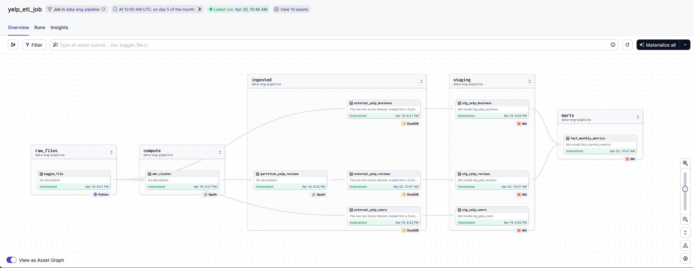

# Yelp Data Insights Dashboard

## Problem Statement

Handling large datasets such as Yelp's business reviews and user data poses a significant challenge in data processing and analytics. Traditional methods that involve loading massive datasets directly into memory can lead to system crashes and slow processing speeds. This project aims to implement a scalable solution that efficiently processes approximately 8GB of data using advanced ETL techniques and big data technologies, ensuring that insights are both accessible and actionable.

## Datasets

| Name                               | Size   |
|--------------------------------------|--------|
| `yelp_academic_dataset_review.json`   | 5 GB  |
| `yelp_academic_dataset_business.json`  | 113 MB |
| `yelp_academic_dataset_user.json`      | 3.1 GB |
| `yelp_academic_dataset_tip.json`       | 172 MB |
| `yelp_academic_dataset_checkin.json`   | 238 MB |


## Technologies

- **Cloud**: AWS S3 services are used for hosting and processing the data.
- **Workflow orchestration**: Dagster manages the workflow, coordinating tasks such as Spark job execution and data transformation.
- **Data Warehouse**: Motherduck, a serverless SQL platform, is used for querying and managing data.
- **Batch processing**: Apache Spark processes the JSON files in the AWS EMR cluster.
- **Transformations**: dbt models the data within Motherduck, optimizing it for analysis and dashboarding.
- **Visualization**: Streamlit is used for data visualization.


## Batch Data Pipeline

The project employs a **batch processing** method using Apache Spark, DuckDB and dbt to handle large datasets efficiently:




### Pipeline Assets:
- [**Kaggle**](dagster_capstone/assets/kaggle.py)
   - `kaggle_file`: downloads and unzips the Yelp dataset from the Kaggle API and uploads it to AWS S3. This dataset consists of 5 json datasets that are ~8GB total in size.
- [**Apache Spark**](dagster_capstone/assets/spark.py) The following asset module defines two dagster assets:
   1. [`emr_cluster`](dagster_capstone/assets/external_create_emr_cluster.py): This asset defines logic for orchestrating external python code, which Dagster refers to as Dagster Pipes. More specifically, the emr_cluster asset executes the `external_create_emr_cluster.py` script which handles the creation of an AWS EMR Cluster, which is a cluster of EC2 instances that will run our PySpark code (similar to Google's Dataproc).
   2. [`partition_yelp_reviews`](dagster_capstone/assets/external_run_spark_job.py): This asset executes the `external_run_spark_job.py` script, which submits a spark job to the previously created cluster from the upstream asset. The spark code is defined within [`emr_spark_yelp_reviews.py`](emr-resources/spark-code/emr_spark_yelp_reviews.py). I implemented Spark here due to the size of the yelp_academic_dataset_business.json being roughly ~5GB in size. Loading that amount of data directly into memory and using Pandas to perform transformations was not practical in this scenario as it would frequently crash my orchestration tool. 
   
- [**Yelp**](dagster_capstone/assets/yelp.py) This module defines 3 assets which all use DuckDB to load our data from an AWS S3 bucket and ingest the data sources into Motherduck DWH as external tables.
   - `external_yelp_reviews` 
   - `external_yelp_users` 
   - `external_yelp_business`

- [**dbt**](dagster_capstone/assets/dbt.py) This module maps our dbt Models to Dagster Assets, which allows us to materialize our dbt models programatically. The `dbt_analytics` asset runs `dbt build --target prod` which runs each model we have defined in our dbt directory. These models include: 
   - [`staging_yelp_reviews`](analytics/models/staging/yelp/stg_yelp_reviews.sql)
   - [`staging_yelp_users`](analytics/models/staging/yelp/stg_yelp_users.sql)
   - [`staging_yelp_business`](analytics/models/staging/yelp/stg_yelp_business.sql)
   - [`fact_monthly_metrics`](analytics/models/marts/yelp/fact_monthly_metrics.sql)
   


## Dashboard

The dashboard is implemented using Streamlit to visualize data from Motherduck:
- **Graph 1**: Shows the distribution of Yelp reviews across different categories.
- **Graph 2**: Tracks average review scores over time, highlighting trends and outliers.


## Setup and Configuration

Before doing anything else, be sure to clone this repo to your local computer.

### Project Dependencies

1. **Install Python 3.10**:
   - Download and install Python 3.10 from the [official Python website](https://www.python.org/downloads/).

2. **Install AWS CLI**:
   - Follow the instructions provided in the [AWS CLI documentation](https://docs.aws.amazon.com/cli/latest/userguide/cli-chap-install.html) to install AWS CLI for your operating system.

### **Create a Virtual Environment**
Within the project repo, open up a terminal and run the following commands: 

   - **Linux/MacOS**:
     ```bash
     python3.10 -m venv myenv
     cd myenv/bin
     chmod +x activate
     source myenv/bin/activate
     ```
   - **Windows**:
     ```cmd
     python3.10 -m venv myenv
     .\myenv\Scripts\activate
     ```

1. **Install Dagster**

   Install the Dagster code location as a Python package within our newly create virtual environment.
   
    ```shell
    pip install -e ".[dev]"
    ```
    
3. **Install Streamlit**

   As a part of `setup.py`, [Streamlit](https://streamlit.io/#install) should already be installed after running ```pip install -e "[.dev]"```, but be sure to validate by running the following command in your terminal:

   ```shell
   streamlit hello
   ```

### **Configuring S3 Permissions**

### Step 1: Create an AWS IAM User

1. **Log into the AWS Management Console** and navigate to the IAM (Identity and Access Management) dashboard.

2. **Create a New IAM User:**
   - In the IAM dashboard, click on "Users" then "Add user".
   - Enter a user name.
   - Select "Programmatic access" as the access type. This enables an access key ID and secret access key for the AWS API, CLI, SDK, and other development tools.
   - Click "Next: Permissions".

3. **Review and Create User:**
   
   Review the user details (we will define the permissions in the next step) then click "Create user".

5. **Download the Credentials:**
   
   On the final screen, you’ll have the opportunity to download the `.csv` file containing the new user's `AWS_ACCESS_KEY_ID` and `AWS_SECRET_ACCESS_KEY`. Make sure to download this file and copy these two credentials over to the `.env` file in our project.


### Step 2: AWS EMR Permissions Setup

1. **Run the AWS CLI Configuration Command:**

    When you run aws configure, it will prompt you to enter your `AWS Access Key ID`, `AWS Secret Access Key` and `Default region name`, such as `us-east-1`. details interactively, one by one. After providing this information, AWS CLI will store these configurations locally on your system, typically in a file located at ~/.aws/credentials on Unix-like systems or C:\Users\USERNAME\.aws\credentials on Windows systems. These credentials are used by AWS CLI to authenticate and authorize your requests to AWS services.

   ```bash
   aws configure
   ```
1. **Define a trust policy for EMR**
    In your code edtior, save the following JSON policy as `emr-trust-policy.json` within the project repo:
      ```json
      {
        "Version": "2012-10-17",
        "Statement": [
          {
            "Effect": "Allow",
            "Principal": {
              "Service": "elasticmapreduce.amazonaws.com"
            },
            "Action": "sts:AssumeRole"
          }
        ]
      }
      ```

2. **Create the Service Role**
    ```bash
    aws iam create-role --role-name MyDagsterEMRServiceRole --assume-role-policy-document file://emr-trust-policy.json
    ```

3. **Attach Policies to the Role**
    ```bash
    aws iam attach-role-policy --role-name MyDagsterEMRServiceRole --policy-arn arn:aws:iam::aws:policy/service-role/AmazonElasticMapReduceRole
    aws iam attach-role-policy --role-name MyDagsterEMRServiceRole --policy-arn arn:aws:iam::aws:policy/service-role/AmazonElasticMapReduceforEC2Role
    ```

4. **Create an Instance Profile**
    ```bash
    aws iam create-instance-profile --instance-profile-name DagsterEMRInstanceProfile
    ```

5. **Retrieve the Service Role ARN**
    Use the AWS CLI to retrieve the ARN for your new role:
    ```bash
    aws iam get-role --role-name MyDagsterEMRServiceRole
    ```

### Step 3: Retrieve the Subnet ID of your Default VPC in AWS Region us-east-2

1. Fetch the Default VPC

```shell
aws ec2 describe-vpcs --filters Name=is-default,Values=true --region us-east-2 --query "Vpcs[].VpcId" --output text
```

3. Input your `VPC_ID` returned from the previous command into the command below to fetch the list of your Default VPC Subnets and select one and set the `VPC_DEFAULT_SUBNET_ID` env variable to its value.

```shell
aws ec2 describe-subnets --filters "Name=vpc-id,Values=VPC_ID" --region us-east-2 --query "Subnets[*].[SubnetId, CidrBlock, AvailabilityZone]" --output table
```


### Configure Motherduck Settings

#### Step 1: Log into Motherduck

1. **Visit the Motherduck website [here](https://motherduck.com/)**.
2. **Create an account and log in**

#### Step 2: Retrieve the Token

1. Once logged in, navigate to your **account settings** or **developer settings** section.
2. Under **Settings** -> **General** copy your account token under **Service Token** and paste it into our `.env` file as the `MOTHERDUCK_DATABASE` value. The value should look something like
`MOTHERDUCK_DATABASE='md:?motherduck_token=<your-token>'
3. Under **Settings** -> **Secrets** add your newly created `AWS_ACCESS_KEY_ID`, `AWS_SECRET_ACCESS_KEY` and `AWS_REGION` so Motherduck can authenticate to S3.

### Upload Spark Code to S3 ###

1. Open up `install-boto3.sh` and `emr_spark_yelp_reviews.py` within `emr-resources` and be sure to modify the code in each to reference your S3 bucket, otherwise the spark job will fail.
2. Upload the `emr-resources` folder into your newly created S3 bucket. Once uploaded, you should have the following files:
```text
- emr-resources/
    - install-boto3.sh
    - equirements.txt
    - spark-code/
        - emr_spark_yelp_reviews.py
```

### Set Environmental Variables

Before we can move on to executing our pipeline, be sure all of your environmental variables are properly set within your Dagster Cloud environment (or the in your local environment via `.env`, which is not recommended).

The last set of credentials we need is for our Kaggle API dataset. Sign in to Kaggle and go to **Settings** -> **API** and select **Create New Token** which will provide you with a `username` and a `key` dictionary. Within Environmental Variables, set `KAGGLE_KEY` and `KAGGLE_USERNAME` to these values.

Now be sure to review the following and and set each one within the **Deployments** -> **Environmental Variables** within Dagster Cloud, or locally by duplicating the `.env.example` file and renaming it to `.env`:

```shell
KAGGLE_USERNAME='<your-username>'
KAGGLE_KEY='<your-key>'
DAGSTER_ENVIRONMENT='prod'
DAGSTER_DBT_PARSE_PROJECT_ON_LOAD=1
AWS_ACCESS_KEY_ID='<your_aws_access_key_id>'
AWS_SECRET_ACCESS_KEY='<your_aws_secret_access_key>'
AWS_REGION='us-east-2'
VPC_SUBNET_ID='<your_default_vpc_subnet_id>'
S3_BUCKET_PREFIX='s3://<your-bucket-name>/'
S3_SPARK_CODE_PREFIX='emr-resources/spark-code/emr_spark_yelp_reviews.py'
DUCKDB_DATABASE=data/staging/data.duckdb
MOTHERDUCK_DATABASE='md:yelp?motherduck_token=<your_motherduck_token>'
```

## Checklist ##

So far, we have:
- Created an AWS S3 bucket.
- Created an AWS IAM User.
- Downloaded an AWS Access Key and Secret.
- Configured required permissions for Spark and S3 using AWS CLI.
- Uploaded Spark code to S3
- Generated a Motherduck token.


### Run Dagster

#### **Run Dagster Cloud (Recommended)**

   1. Create a Dagster+ Cloud Free Trial Account and sign in.
   2. Follow documentation [here](https://docs.dagster.io/dagster-plus/deployment/serverless#with-github) to deploy with a single click via GitHub Actions.
   3. Set Environmental Variables under **Deployment** -> **Environmental Variables**.
   4. Publish your repo to Github.
   5. Add your Code Location by navigating to Dagster+ and connecting your GitHub account.

**OR**

#### **Run Dagster Locally**
    
   Likely will fail unless you have high internet bandwidth/particullary high upload speeds as it takes a long time to ingest into the S3 bucket.

   Start the Dagster development environment:
    ```bash
    dagster dev
    ```

   Visit http://localhost:3000 to access the Dagster interface.

   
## Execute Pipeline Job

Navigate to the **Overview** -> **Jobs** -> **yelp_etl_job** on Dagster's interface and select the **Materialize All** button. Note: Running this locally is not recommended due to the dataset size and potential AWS S3 upload times. Consider using Dagster Cloud Serverless, which offers a 30-day free trial.

## Run Streamlit

In the root of the project repo, run to view the dashboard at http://localhost:8501.

The Dashboard Should look as follows: 

```shell
streamlit run capstone.py
```


## Additional Resources 

- [Using Dagster with Spark](https://docs.dagster.io/integrations/spark#asset-accepts-and-produces-dataframes-or-rdds)
- [emr_pyspark_launcher](https://github.com/dagster-io/dagster/blob/master/python_modules/libraries/dagster-aws/dagster_aws/emr/pyspark_step_launcher.py)
- [Create default roles for EMR Cluster](https://docs.aws.amazon.com/cli/latest/reference/emr/create-default-roles.html#create-default-roles)
- [AWS S3 multipart upload documentation](https://docs.aws.amazon.com/AmazonS3/latest/userguide/mpuoverview.html#sdksupportformpu)
- [Understanding files in your dagster project](https://docs.dagster.io/guides/understanding-dagster-project-files)
   - [dagster_cloud.yml](https://docs.dagster.io/dagster-plus/managing-deployments/dagster-cloud-yaml)
