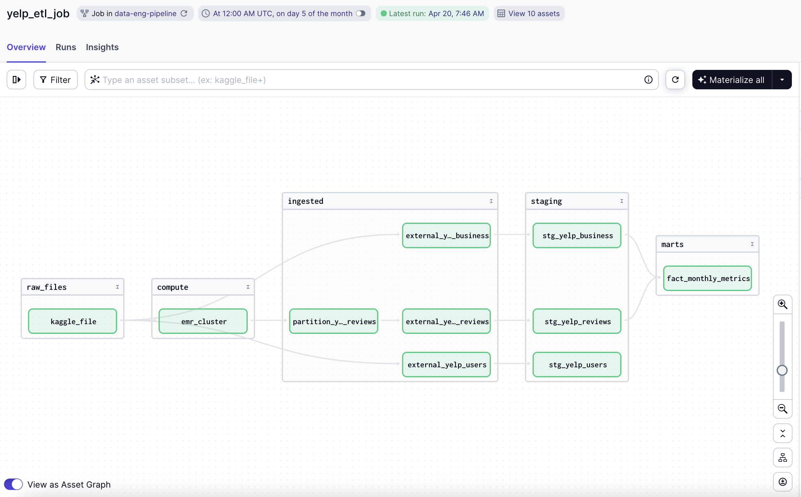

# Yelp Data Insights Dashboard

## Objective

The goal of this project is to apply the knowledge and skills learned throughout the data engineering course to construct an end-to-end data pipeline that processes a large dataset and visualizes key business metrics.

## Problem Statement

The project aims to create a dashboard with two tiles by:
- Selecting a dataset of Yelp business reviews.
- Creating a pipeline for processing this dataset and storing it in a data lake.
- Moving the data from the lake to a data warehouse.
- Transforming the data in the data warehouse to prepare it for visualization.
- Building a dashboard to display insights from the data effectively.

## Data Pipeline

The project employs a **batch processing** method using Apache Spark to handle large datasets efficiently:
- **Batch**: The pipeline processes data periodically from a static dataset downloaded from Kaggle, consisting of multiple JSON files.




## Technologies

- **Cloud**: AWS services are used for hosting and processing the data.
- **Workflow orchestration**: Dagster manages the workflow, coordinating tasks such as Spark job execution and data transformation.
- **Data Warehouse**: Motherduck, a serverless SQL platform, is used for querying and managing data.
- **Batch processing**: Apache Spark processes the JSON files in the AWS EMR cluster.
- **Transformations**: dbt models the data within Motherduck, optimizing it for analysis and dashboarding.

## Dashboard

The dashboard is implemented using Streamlit to visualize data from Motherduck:
- **Graph 1**: Shows the distribution of Yelp reviews across different categories.
- **Graph 2**: Tracks average review scores over time, highlighting trends and outliers.

## Setup and Configuration


### Install Python 3.10 and AWS CLI

1. **Install Python 3.10**:
   - Download and install Python 3.10 from the [official Python website](https://www.python.org/downloads/).

2. **Install AWS CLI**:
   - Follow the instructions provided in the [AWS CLI documentation](https://docs.aws.amazon.com/cli/latest/userguide/cli-chap-install.html) to install AWS CLI for your operating system.


### **Create a Virtual Environment**
Within the project repo, open up a terminal and run the following commands: 

   - **Linux/MacOS**:
     ```bash
     python3.10 -m venv myenv
     cd myenv/bin
     chmod +x activate
     source myenv/bin/activate
     ```
   - **Windows**:
     ```cmd
     python3.10 -m venv myenv
     .\myenv\Scripts\activate
     ```

### **Configuring S3 Permissions**

### Step 1: Create an AWS IAM User

1. **Log into the AWS Management Console** and navigate to the IAM (Identity and Access Management) dashboard.

2. **Create a New IAM User:**
   - In the IAM dashboard, click on "Users" then "Add user".
   - Enter a user name.
   - Select "Programmatic access" as the access type. This enables an access key ID and secret access key for the AWS API, CLI, SDK, and other development tools.
   - Click "Next: Permissions".

3. **Review and Create User:**
   
   Review the user details (we will define the permissions in the next step) then click "Create user".

5. **Download the Credentials:**
   
   On the final screen, you’ll have the opportunity to download the `.csv` file containing the new user's Access Key ID and Secret Access Key. Make sure to download this file and copy the credentials over to the `.env` file in our project.


### Step 2: AWS EMR Permissions Setup

1. **Run the AWS CLI Configuration Command:**

    When you run aws configure, it will prompt you to enter your `AWS Access Key ID`, `AWS Secret Access Key` and `Default region name`, such as `us-east-1`. details interactively, one by one. After providing this information, AWS CLI will store these configurations locally on your system, typically in a file located at ~/.aws/credentials on Unix-like systems or C:\Users\USERNAME\.aws\credentials on Windows systems. These credentials are used by AWS CLI to authenticate and authorize your requests to AWS services.

   ```bash
   aws configure
   ```
1. **Define a trust policy for EMR**
    In your code edtior, save the following JSON policy as `emr-trust-policy.json` within the project repo:
      ```json
      {
        "Version": "2012-10-17",
        "Statement": [
          {
            "Effect": "Allow",
            "Principal": {
              "Service": "elasticmapreduce.amazonaws.com"
            },
            "Action": "sts:AssumeRole"
          }
        ]
      }
      ```

2. **Create the Service Role**
    ```bash
    aws iam create-role --role-name MyDagsterEMRServiceRole --assume-role-policy-document file://emr-trust-policy.json
    ```

3. **Attach Policies to the Role**
    ```bash
    aws iam attach-role-policy --role-name MyDagsterEMRServiceRole --policy-arn arn:aws:iam::aws:policy/service-role/AmazonElasticMapReduceRole
    aws iam attach-role-policy --role-name MyDagsterEMRServiceRole --policy-arn arn:aws:iam::aws:policy/service-role/AmazonElasticMapReduceforEC2Role
    ```

4. **Create an Instance Profile**
    ```bash
    aws iam create-instance-profile --instance-profile-name DagsterEMRInstanceProfile
    ```

5. **Retrieve the Service Role ARN**
    Use the AWS CLI to retrieve the ARN for your new role:
    ```bash
    aws iam get-role --role-name MyDagsterEMRServiceRole
    ```

### Configure Motherduck Settings

#### Step 1: Log into Motherduck

1. **Visit the Motherduck website [here](https://motherduck.com/)**.
2. **Create an account and log in**

#### Step 2: Retrieve the Token

1. Once logged in, navigate to your **account settings** or **developer settings** section.
2. Under **Settings** -> **General** copy your account token under **Service Token** and paste it into our `.env` file as the `MOTHERDUCK_TOKEN` value.
3. Under **Settings** -> **Secrets** add your newly created Amazon S3 Secret.

### Upload Spark Code to S3 ###

1. Open up `install-boto3.sh` and `emr_spark_yelp_reviews.py` within `emr-resources` and be sure to modify the code in each to reference your S3 bucket, otherwise the spark job will fail.
2. Upload the `emr-resources` folder into your newly created S3 bucket. Once uploaded, you should have the following files:
```text
- emr-resources/
    - install-boto3.sh
    - equirements.txt
    - spark-code/
        - emr_spark_yelp_reviews.py
```

### Set Environmental Variables

Before we can move on to executing our pipeline, be sure all of your environmental variables are properly set in your `.env` file or within the **Deployment** -> **Environmental Variables** form in your Dagster Cloud environment.

Set up the following environment variables by duplicating the `.env.example` file and renaming it to `.env`:
```shell
DUCKDB_DATABASE=data/staging/data.duckdb
DAGSTER_ENVIRONMENT='prod'
DAGSTER_DBT_PARSE_PROJECT_ON_LOAD=1
AWS_ACCESS_KEY_ID='<your_aws_access_key_id>'
AWS_SECRET_ACCESS_KEY='<your_aws_secret_access_key>'
AWS_REGION='us-east-2'
S3_BUCKET_PREFIX='s3://your-bucket-name/'
MOTHERDUCK_TOKEN='<your_motherduck_token>'
```

## Checklist ##

So far, we have:
- Created an AWS S3 bucket.
- Created an AWS IAM User.
- Created a
- Downloaded an AWS Access Key and Secret.
- Configured necessary permissions for Spark and S3 using AWS CLI.
- Uploaded Spark code to S3
- Generated a Motherduck token.


### Dagster Setup

1. **Install Dagster**

   Install our Dagster code location as a Python package:
    ```bash
    pip install -e ".[dev]"
    ```

 2. **Run Dagster Cloud (Recommended)**

   1. Create a Dagster+ Cloud Free Trial Account
   2. Follow documentation [here](https://docs.dagster.io/dagster-plus/deployment/serverless#with-github) to deploy with a single click via GitHub Actions.
   3. Set Environmental Variables under **Deployment** -> **Environmental Variables**

3. **Run Dagster Locally**
    
   Likely will fail unless you have high internet bandwidth/particullary high upload speeds as it takes a long time to ingest into the S3 bucket.

   Start the Dagster development environment:
    ```bash
    dagster dev
    ```

   Visit http://localhost:3000 to access the Dagster interface.

   
## Execute Pipeline Job

Navigate to the **Overview** -> **Jobs** -> **yelp_etl_job** on Dagster's interface and select the **Materialize All** button. Note: Running this locally is not recommended due to the dataset size and potential AWS S3 upload times. Consider using Dagster Cloud Serverless, which offers a 30-day free trial.

## Run Streamlit

In the root of the project repo, run to view the dashboard at http://localhost:8501.

The Dashboard Should look as follows: 

```shell
streamlit run capstone.py
```


## Additional Resources 

- [Using Dagster with Spark](https://docs.dagster.io/integrations/spark#asset-accepts-and-produces-dataframes-or-rdds)
- [emr_pyspark_launcher](https://github.com/dagster-io/dagster/blob/master/python_modules/libraries/dagster-aws/dagster_aws/emr/pyspark_step_launcher.py)
- [Create default roles for EMR Cluster](https://docs.aws.amazon.com/cli/latest/reference/emr/create-default-roles.html#create-default-roles)
- [AWS S3 multipart upload documentation](https://docs.aws.amazon.com/AmazonS3/latest/userguide/mpuoverview.html#sdksupportformpu)
- [Understanding files in your dagster project](https://docs.dagster.io/guides/understanding-dagster-project-files)
   - [dagster_cloud.yml](https://docs.dagster.io/dagster-plus/managing-deployments/dagster-cloud-yaml)
